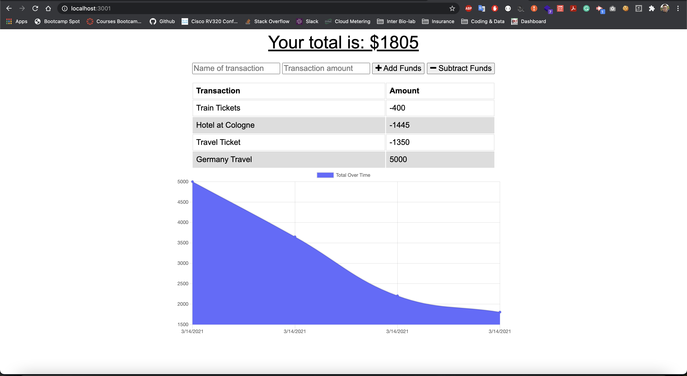

# 19-PWA-Challenge
Budget Tracker App

## Table of Contents

* [Description](#Description)
* [Requirements](#Requirements)
* [Installation](#Installation)
* [Usage](#Usage)
* [License](#License)
* [Badges](#Badges)
* [Issues](#Issues)
* [Technologies](#Technologies)
* [Screenshot](#screenshot)
* [Deployment](#deployment)
* [Contributing](#Contributing)
</br>
</br>

## Description
Giving users a fast and easy way to track their money is important, but allowing them to access that information at any time is even more important. Having offline functionality is paramount to the success of an application that handles users’ financial information.
<br>
<br>

## Requirements

#### User Story
>AS AN avid traveler, I WANT to be able to track my withdrawals and deposits with or without a data/internet connection. SO THAT my account balance is accurate when I am traveling
<br>

>GIVEN a budget tracker without an internet connection
<br>

>WHEN the user inputs an expense or deposit<br>
>>THEN they will receive a notification that they have added an expense or deposit<br>

>WHEN the user reestablishes an internet connection<br>
>>THEN the deposits or expenses added while they were offline are added to their transaction history and their totals are updated<br>
<br>
<br>

## Installation
To use this application, please install: 
```
npm install
```

<br/>
<br/>

## Usage
In order to use the application, run the following commands:
```
npm start
```

<br/>
<br/>

## License 
[](https://opensource.org/licenses/MIT)
</br>
</br>

## Badges


</br>
</br>

## Issues
[](https://GitHub.com/jorgeebn16/19-PWA-Challenge/issues/)
[](https://GitHub.com/jorgeebn16/19-PWA-Challenge/issues?q=is%3Aissue+is%3Aclosed)
</br>
</br>

## Technologies
* [Javascript](https://developer.mozilla.org/en-US/docs/Web/JavaScript)
* [npm](https://www.npmjs.com/)
* [mongoose](https://mongoosejs.com/)
* [pwa](https://web.dev/progressive-web-apps/)
* [compression](https://www.npmjs.com/package/compression)
* [morgan](https://www.npmjs.com/package/morgan)
<br/>
<br/>

## Screenshot


</br>
</br>

## Deployment
View [Heroku App](https://jorgeebn16-budget-tracker.herokuapp.com)

## Contributing
[](https://GitHub.com/Naereen/jorgeebn16/19-PWA-Challenge/graphs/contributors/)

For anyone who wishes to contribute you can contact me with at jorgeebn16@gmail.com
</br>
</br>

Would you like to reach me?
</br>
Contact Me:

Github: https://github.com/jorgeebn16</br>
Email: jorgeebn16@gmail.com


## Issues
[](https://GitHub.com/jorgeebn16/19-PWA-Challenge/issues/)
[](https://GitHub.com/jorgeebn16/19-PWA-Challenge/issues?q=is%3Aissue+is%3Aclosed)


